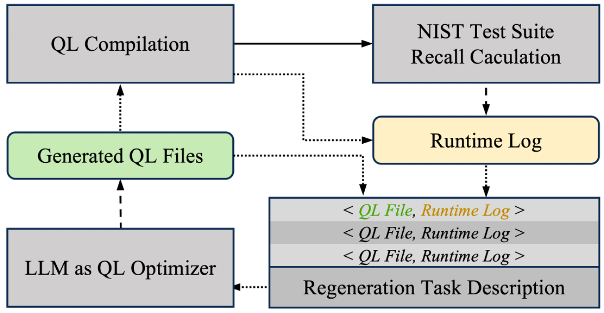

# QL-Relax

**An Experimental Approach to Relaxing CodeQL Constraints Using LLMs**

This project explores an alternative to generating CodeQL queries from scratch (which often produces syntax errors). Instead, we experiment with using LLMs to systematically relax conservative constraints in existing official CodeQL queries. Our hypothesis is that many official queries prioritize low false positive rates through aggressive pruning, potentially missing edge cases that could be valuable in certain security contexts.

## Architecture



## Setup

### Requirements
- Claude Code
- Docker
- Git
- ~50GB disk space

### First Time Setup
0. Clone & CD the project
1. Clone required repositories:
```bash
mkdir -p qlworkspace/origin
cd qlworkspace/origin
git clone https://github.com/github/codeql.git
cd ../..

# Clone Juliet test suite
git clone https://github.com/arichardson/juliet-test-suite-c.git
```

2. Build and start Docker:
```bash
./start_docker.sh
```

3. Create CodeQL databases:
```bash
python3 run_juliet.py --create-db --all
```

4. Create initial workspaces:
```bash
python3 run_juliet.py --create-workspace --all
```

### Running

```bash
# Single CWE
python3 run_ql_workflow.py --cwe 190

# Multiple CWEs  
python3 run_ql_workflow.py --cwe 190 134 78

# All supported CWEs
python3 run_ql_workflow.py --all
```

## How It Works

This experimental workflow attempts to improve vulnerability detection through constraint relaxation:

1. **Start with Official Queries**: Use production-tested CodeQL queries as a reliable foundation
2. **LLM-Guided Relaxation**: Experiment with removing conservative filters and constraints
3. **Test on Juliet Suite**: Validate whether relaxed queries catch more known vulnerabilities
4. **Iterate Carefully**: Balance between finding more issues and maintaining query validity

## Docker Setup

The system uses a fixed container name `ql-relax-container`. 

```bash
docker build -t ql-relax:latest .
docker run -d --name ql-relax-container -v $(pwd):/workspace ql-relax:latest
```

## Project Structure

```
QL-Relax/
├── BaseMachine/          # LLM state machine framework
├── QLWorkflow/           # Query optimization workflow
├── juliet-test-suite-c/  # Juliet test cases (mount or symlink)
├── run_juliet.py         # Single CWE runner
└── run_ql_workflow.py    # Multi-CWE pipeline
```

## Configuration

Environment variables (optional):
- `JULIET_PATH`: Path to Juliet test suite
- `CODEQL_DB_PATH`: Path to CodeQL databases

## Supported CWEs

We select CWEs that have both path-problem queries and Juliet testsuites to build a closed loop.
